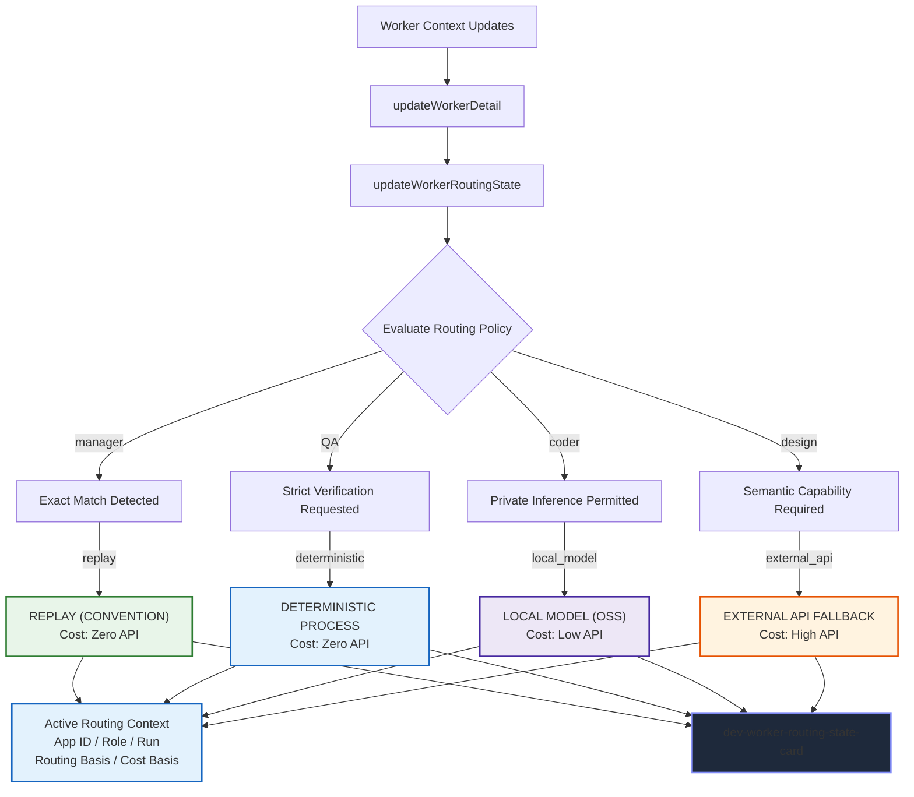

# Hybrid Routing Flow

Governs: how the workspace maps active workers to the execution routing system (SI13).

```mermaid
flowchart TD
    A[Worker Context Updates] --> B[updateWorkerDetail]
    B --> C[updateWorkerRoutingState]
    
    C --> D{Evaluate Routing Policy}
    D -->|manager| E_M[Exact Match Detected]
    D -->|QA| E_Q[Strict Verification Requested]
    D -->|coder| E_C[Private Inference Permitted]
    D -->|design| E_D[Semantic Capability Required]

    E_M -->|replay| S1["REPLAY (CONVENTION)\nCost: Zero API"]
    E_Q -->|deterministic| S2["DETERMINISTIC PROCESS\nCost: Zero API"]
    E_C -->|local_model| S3["LOCAL MODEL (OSS)\nCost: Low API"]
    E_D -->|external_api| S4["EXTERNAL API FALLBACK\nCost: High API"]

    S1 --> CTX["Active Routing Context\nApp ID / Role / Run\nRouting Basis / Cost Basis"]
    S2 --> CTX
    S3 --> CTX
    S4 --> CTX

    S1 --> UI[dev-worker-routing-state-card]
    S2 --> UI
    S3 --> UI
    S4 --> UI

    classDef pass fill:#e8f5e9,stroke:#2e7d32,stroke-width:2px
    classDef warn fill:#fff3e0,stroke:#e65100,stroke-width:2px
    classDef fail fill:#ffebee,stroke:#c62828,stroke-width:2px
    classDef local fill:#ede7f6,stroke:#4527a0,stroke-width:2px
    classDef info fill:#e3f2fd,stroke:#1565c0,stroke-width:2px
    
    class S1 pass
    class S2 info
    class S3 local
    class S4 warn
    class CTX info

    style UI fill:#1e293b,stroke:#818cf8,stroke-width:2px
```
