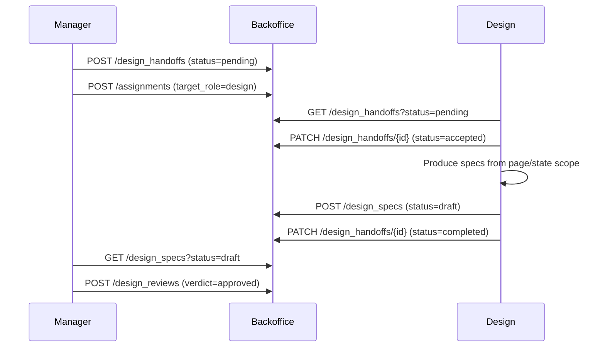

# Manager-to-Design Handoff Contract

## Purpose

Defines the explicit object contract for what the manager passes to design when routing a bounded assignment with `target_role = design`.

## Handoff Record Schema

| Field | Type | Required | Description |
|-------|------|----------|-------------|
| `request_id` | ref:requests | yes | Source request from the manager pipeline |
| `assignment_id` | ref:assignments | yes | Bounded assignment created by the manager |
| `project_id` | ref:projects | yes | Target project scope |
| `target_pages` | text | yes | Comma-separated page identifiers from the project page map |
| `state_scope` | text | no | UI states the design must address |
| `constraints` | text | no | Design constraints (accessibility, performance, branding) |
| `expected_artifacts` | text | yes | What design must produce (e.g., "page_map, ui_state, component_state") |
| `status` | enum | yes | `pending` → `accepted` → `completed` |

## Storage

Handoff records live in the `design_handoffs` backoffice table under `solace-dev-manager`.

**REST endpoint**: `POST /api/v1/backoffice/solace-dev-manager/design_handoffs`

## Sample Payload

```json
{
  "request_id": "req-001",
  "assignment_id": "asgn-001",
  "project_id": "proj-solace-browser",
  "target_pages": "overview, dev_workspace, sessions",
  "state_scope": "scan → gate → dashboard → tab_navigation",
  "constraints": "dark-mode-first, accessible, existing sb- design system",
  "expected_artifacts": "page_map, ui_state_map, component_state_map, handoff_flow",
  "status": "pending"
}
```

## Flow


