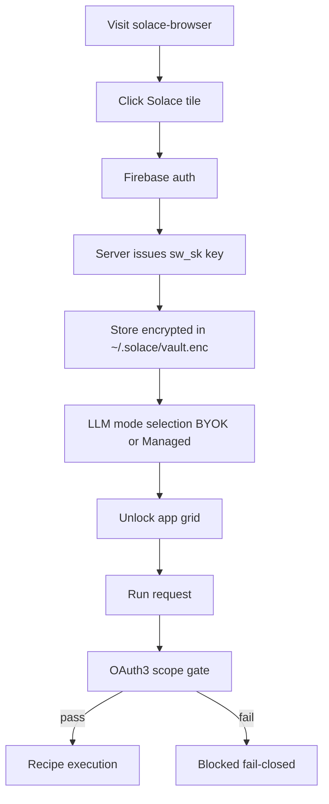

# Browser Auth Flow

```mermaid
flowchart TD
    V[Visit solace-browser] --> T[Click Solace tile]
    T --> F[Firebase auth]
    F --> K[Server issues sw_sk key]
    K --> E[Store encrypted in ~/.solace/vault.enc]
    E --> L[LLM mode selection BYOK or Managed]
    L --> U[Unlock app grid]

    U --> A[Run request]
    A --> G[OAuth3 scope gate]
    G -->|pass| R[Recipe execution]
    G -->|fail| B[Blocked fail-closed]
```

## Notes
- Auth is precondition for app execution.
- Token revocation is enforced at gate time.
