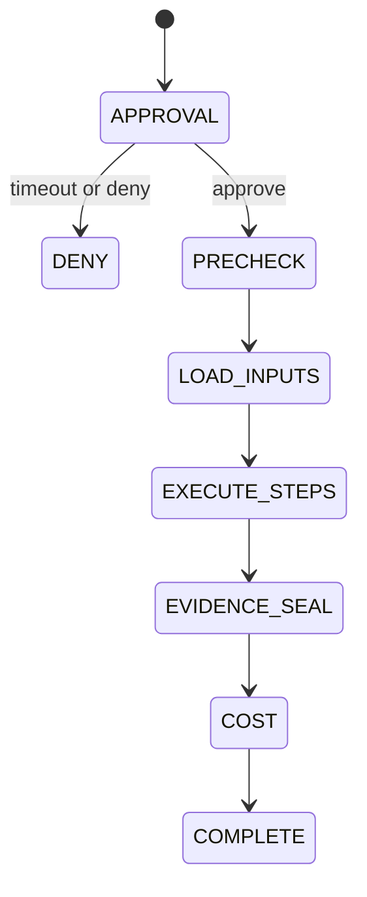
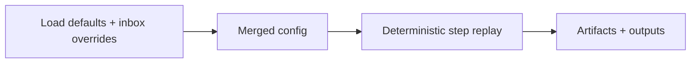

# Recipe Execution

```mermaid
stateDiagram-v2
    [*] --> APPROVAL
    APPROVAL --> DENY: timeout or deny
    APPROVAL --> PRECHECK: approve
    PRECHECK --> LOAD_INPUTS
    LOAD_INPUTS --> EXECUTE_STEPS
    EXECUTE_STEPS --> EVIDENCE_SEAL
    EVIDENCE_SEAL --> COST
    COST --> COMPLETE
```

```mermaid
flowchart LR
    LOAD_INPUTS[Load defaults + inbox overrides] --> MERGE[Merged config]
    MERGE --> STEP[Deterministic step replay]
    STEP --> ART[Artifacts + outputs]
```

## Notes
- No dynamic regeneration of workflow graph during run.
- Step transitions must be reproducible from recipe + inputs.
