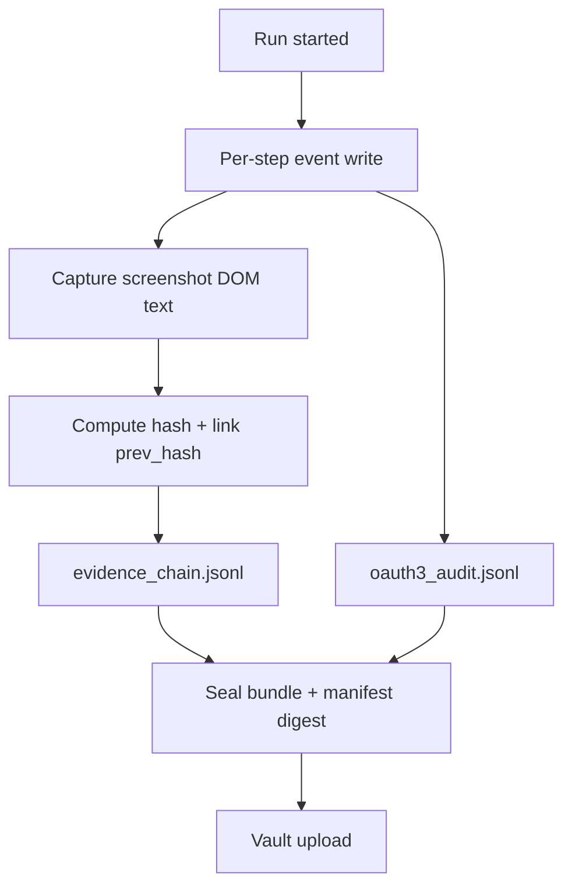

# Evidence Collection

```mermaid
flowchart TD
    START[Run started] --> EVT[Per-step event write]
    EVT --> ART[Capture screenshot DOM text]
    ART --> HASH[Compute hash + link prev_hash]
    HASH --> CHAIN[evidence_chain.jsonl]
    EVT --> AUDIT[oauth3_audit.jsonl]
    CHAIN --> SEAL[Seal bundle + manifest digest]
    AUDIT --> SEAL
    SEAL --> UPLOAD[Vault upload]
```

## Notes
- Hash chain is validated on evidence retrieval.
- Audit and evidence are separate streams sharing run_id.
