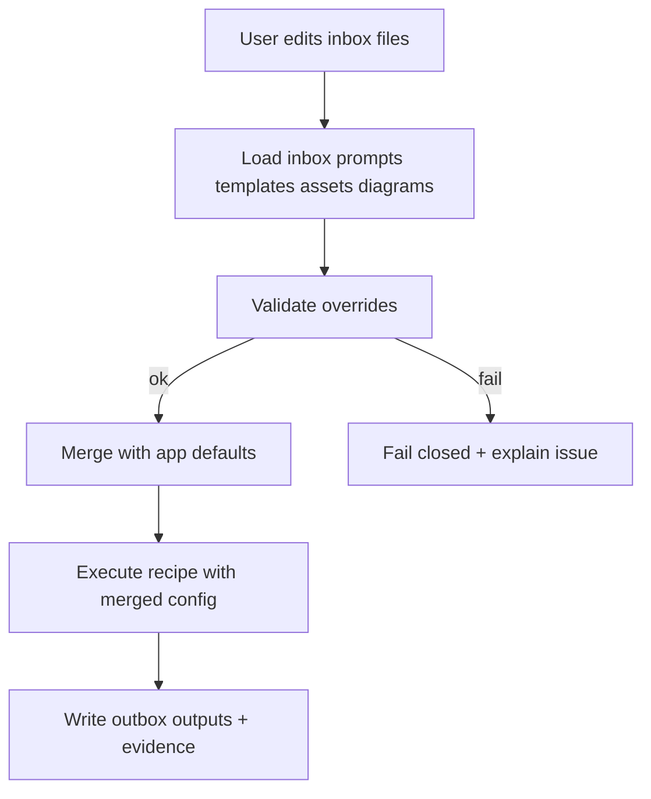

# Customization Flow

```mermaid
flowchart TD
    USER[User edits inbox files] --> LOAD[Load inbox prompts templates assets diagrams]
    LOAD --> VALIDATE[Validate overrides]
    VALIDATE -->|ok| MERGE[Merge with app defaults]
    VALIDATE -->|fail| BLOCK[Fail closed + explain issue]
    MERGE --> RUN[Execute recipe with merged config]
    RUN --> OUT[Write outbox outputs + evidence]
```

## Notes
- Primary path: `~/.solace/inbox/<app>/`.
- Power users can supply diagram overrides in `inbox/diagrams/`.
