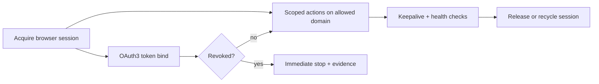

# Session Management

```mermaid
flowchart LR
    OPEN[Acquire browser session] --> USE[Scoped actions on allowed domain]
    USE --> KEEP[Keepalive + health checks]
    KEEP --> DONE[Release or recycle session]

    OPEN --> TOK[OAuth3 token bind]
    TOK --> REVOKE{Revoked?}
    REVOKE -->|yes| STOP[Immediate stop + evidence]
    REVOKE -->|no| USE
```

## Notes
- Session operations are blocked when token/scopes fail.
- Session lifecycle emits audit events for start/stop/failure.
