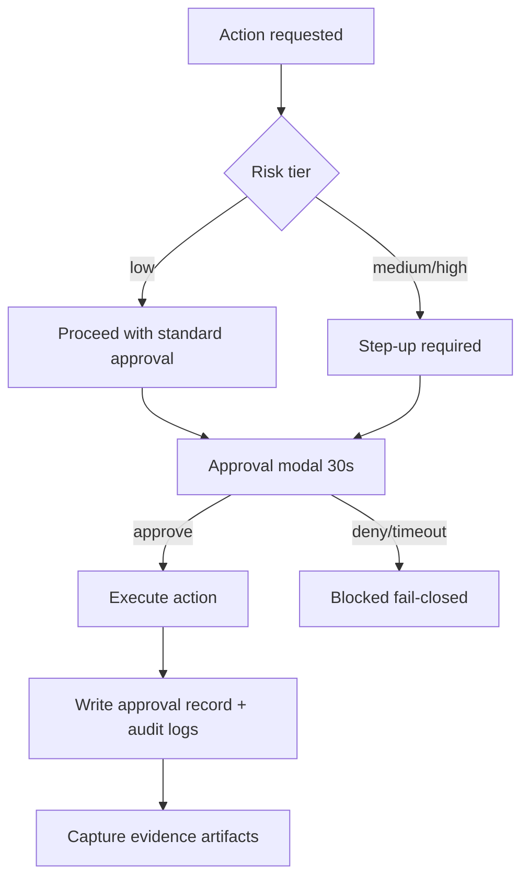

# Approval + Step-Up Flow

```mermaid
flowchart TD
    REQ[Action requested] --> RISK{Risk tier}
    RISK -->|low| AUTO[Proceed with standard approval]
    RISK -->|medium/high| STEPUP[Step-up required]

    AUTO --> MODAL[Approval modal 30s]
    STEPUP --> MODAL

    MODAL -->|approve| EXEC[Execute action]
    MODAL -->|deny/timeout| BLOCK[Blocked fail-closed]

    EXEC --> LOG[Write approval record + audit logs]
    LOG --> EVID[Capture evidence artifacts]
```

## Notes
- Timeout defaults to deny.
- High-risk scopes (send/delete/financial) require step-up.
