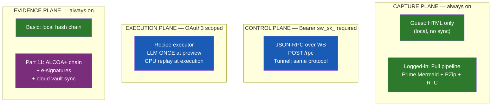

# Diagram 08: Four-Plane Browser Architecture
**Date:** 2026-03-01 | **Auth:** 65537
**Cross-ref:** Paper 05 (PZip), Paper 06 (Evidence), Paper 03 (Web-Native)

---

## Four Independent Planes

## Plane Independence

| Plane | Auth | Internet | PZip |
|-------|------|----------|------|
| Capture (guest) | No | No | No |
| Capture (logged) | Yes | Yes (sync) | Yes |
| Control | Yes | No (local) / Yes (tunnel) | No |
| Execution | Yes | No (local) / Yes (cloud) | No |
| Evidence (basic) | No | No | No |
| Evidence (Part 11) | Yes | Yes (vault sync) | Yes |

## Invariants

1. Each plane operates independently — failure in one does not affect others
2. Capture plane works offline, always (guest mode)
3. Control plane requires Bearer sw_sk_ on every request
4. Execution plane calls LLM ONCE at preview, NEVER during execution
5. Evidence plane captures at event time, never retroactively
