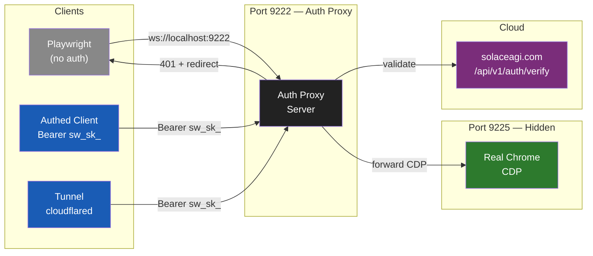

# Diagram 09: OAuth3 Auth Proxy — 3-Layer Defense
**Date:** 2026-03-01 | **Auth:** 65537
**Cross-ref:** Paper 03 (Web-Native), solace-cli/diagrams/02-oauth3-vault.md

---

## 3-Layer Defense Topology



## Layer Details

### Layer 1: Auth Proxy (Port 9222)
- HTTP: check `Authorization: Bearer sw_sk_XXX`
- WebSocket: check `?token=sw_sk_XXX` query param
- `/json`, `/json/version` → fake CDP response (no real endpoints)
- Invalid → `401 {"error": "unauthorized", "redirect": "https://www.solaceagi.com/auth/login"}`

### Layer 2: Hidden Chrome (Port 9225)
- `--remote-debugging-port=9225` (localhost only)
- Only auth proxy connects to it
- Never exposed to network

### Layer 3: Session Token Exchange
```
POST /api/session/start  Authorization: Bearer sw_sk_XXX
→ { session_token: "st_sess_XXX", ws_url: "ws://...", expires_in: 3600 }
```

## Client Response Table

| Client | Attempt | Response |
|--------|---------|----------|
| Playwright (no auth) | ws://localhost:9222 | 401 + redirect |
| Puppeteer (no auth) | http://localhost:9222/json | Fake version JSON |
| curl (no auth) | GET / | Redirect to start.html |
| Authed client | Bearer sw_sk_XXX | Proxied to Chrome :9225 |
| Tunnel | wss://tunnel.solaceagi.com | Proxied through cloudflared |

## Invariants

1. Port 9222 NEVER exposes real CDP endpoints without valid Bearer token
2. Port 9225 is localhost-only, never network-accessible
3. Every request validated against solaceagi.com (no offline key cache)
4. 401 includes redirect URL (helpful, not cryptic)
5. Session tokens are scoped and time-limited (1 hour default)
