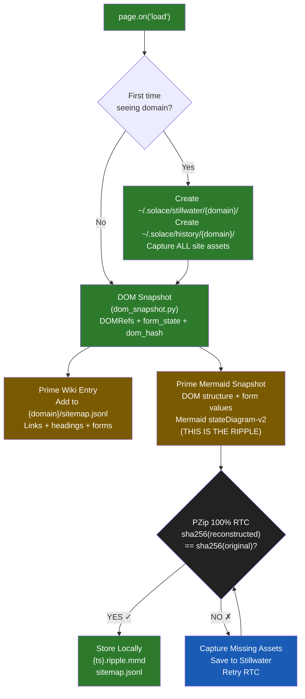
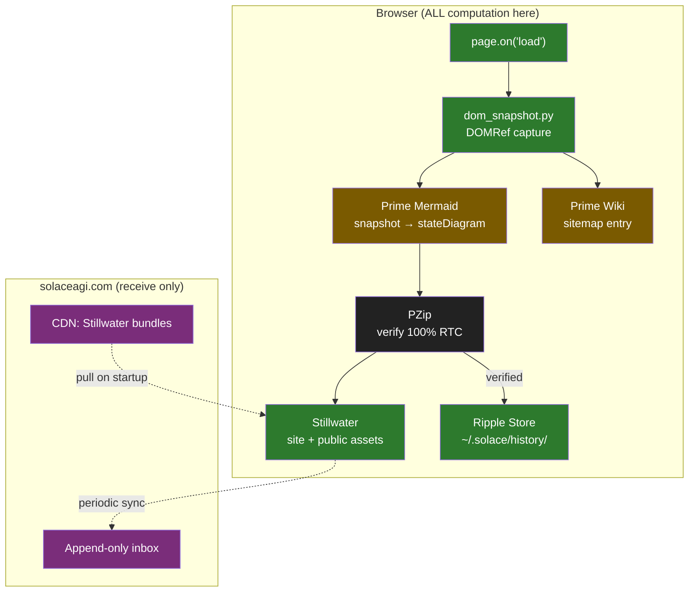

# Diagram 10: Capture Pipeline — page.on('load') to 100% RTC
**Date:** 2026-03-01 | **Auth:** 65537
**Cross-ref:** Paper 05 (PZip Stillwater), Paper 06 (Evidence)

---

## Full Capture Pipeline



## Data Flow



## Storage Layout

```
~/.solace/
  history/{domain}/{ts}.ripple.mmd     ← Prime Mermaid snapshot (2-5 KB)
  history/{domain}/sitemap.jsonl        ← Prime Wiki entries
  stillwater/{domain}/v{N}/             ← site-specific assets (versioned)
  stillwater/public/v{N}/               ← shared libraries
```

## Invariants

1. ALL computation is client-side (zero cloud compute)
2. 100% RTC must pass before ripple is stored
3. Missing assets trigger Stillwater capture + retry (never store invalid ripple)
4. Stillwater versions are never deleted (Part 11 compliance)
5. DOM snapshot uses existing dom_snapshot.py (675 lines, DOMRef system)
6. Prime Mermaid snapshot IS the ripple (not a separate artifact)
