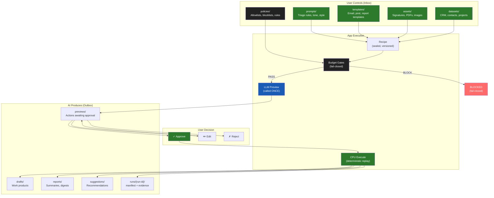

# Diagram 11: App Inbox/Outbox — Universal Folder Contract
**Date:** 2026-03-01 | **Auth:** 65537
**Cross-ref:** Paper 02 (App Standard), solaceagi/papers/13-agent-inbox-outbox.md

---

## Data Flow



## Folder Contract

```
~/.solace/
  inbox/{app-id}/           ← User teaches AI (read-only for AI)
    prompts/                ← Custom instructions
    templates/              ← Reusable templates
    assets/                 ← Files for AI to use
    policies/               ← Hard rules
    datasets/               ← Reference data

  outbox/{app-id}/          ← AI shows work (append-only)
    previews/               ← Awaiting approval
    drafts/                 ← Work products
    reports/                ← Analyses
    suggestions/            ← Recommendations
    runs/{run-id}/          ← Evidence bundles

  apps/{app-id}/            ← App config
    manifest.yaml           ← Metadata + scopes
    recipe.json             ← Steps
    budget.json             ← Limits
    stats.json              ← Auto-generated
```

## Invariants

1. AI reads inbox, NEVER writes to it
2. AI writes outbox, append-only
3. Every run produces manifest.json with hashes
4. Inbox changes hot-reload into next run
5. Budget gates are fail-closed (any failure = BLOCKED)
6. Two mutation paths: VS Code (file edit) or Yinyang (AI edits file)
