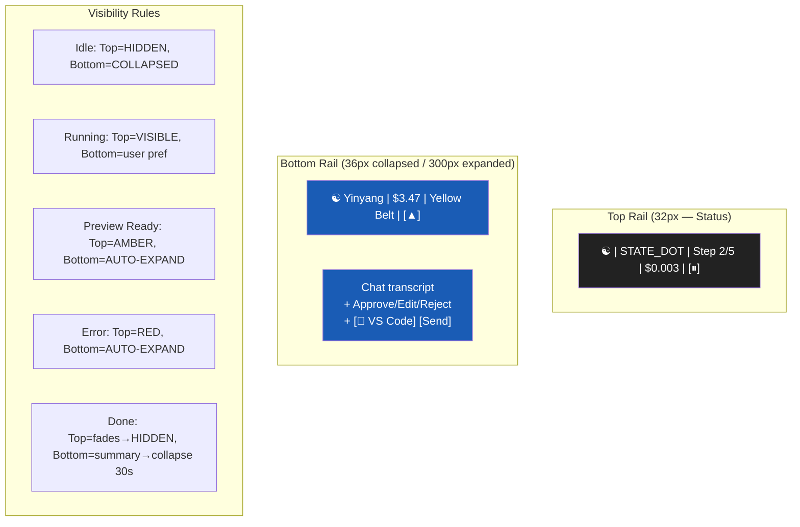
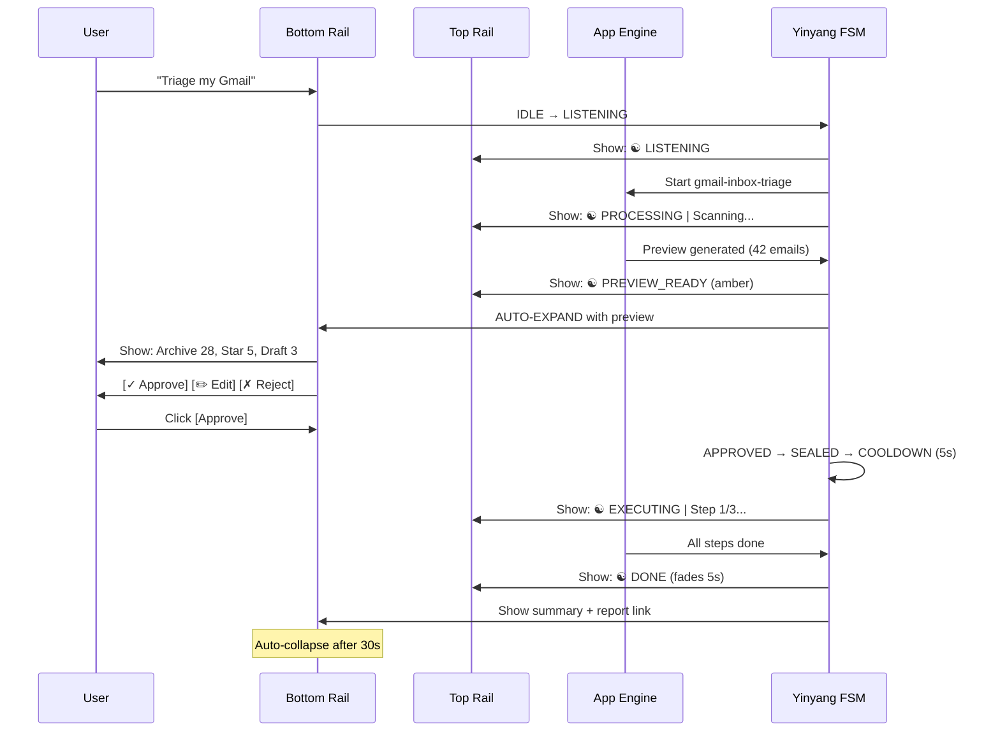

# Diagram 12: Yinyang Dual Rail — Integration with Apps
**Date:** 2026-03-01 | **Auth:** 65537
**Cross-ref:** Paper 04 (Yinyang), solace-cli/diagrams/13-yinyang-fsm.md

---

## Dual Rail Layout

## App Integration Flow

## Keyboard Shortcuts

| Shortcut | Action |
|----------|--------|
| Ctrl+Y / Cmd+Y | Toggle bottom rail |
| Ctrl+Shift+Y | Focus input |
| Escape | Collapse |
| Enter (preview) | Approve |
| Ctrl+. | Pause execution |

## Invariants

1. Top rail = status ONLY (never chat, never forms)
2. Bottom rail = user-summoned for chat (never auto-opens for chat)
3. Auto-expand ONLY for: PREVIEW_READY, BLOCKED, ERROR
4. PREVIEW_READY → APPROVED requires explicit user click
5. Collapse preference persists across sessions
6. Zero forms, toggles, or inputs (except chat input)
