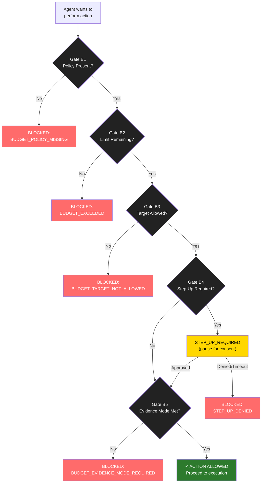
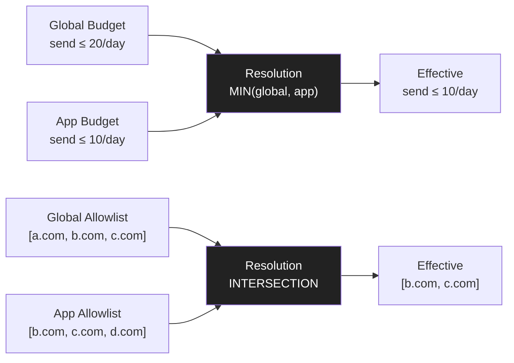

# Diagram 13: Budget Gates — Fail-Closed Enforcement
**Date:** 2026-03-01 | **Auth:** 65537
**Cross-ref:** Paper 07 (Budget), solaceagi/papers/04-wallet-budgets.md

---

## Gate Sequence

## Resolution Rules

- Caps: minimum wins (stricter)
- Allowlists: intersection wins (smaller)
- Step-up: if ANY requires → required
- Evidence: if ANY requires stronger → stronger

## Invariants

1. ANY gate failure = BLOCKED (no fallback, no degrade)
2. Step-up timeout = DENY (not proceed)
3. Budget resolution is deterministic (MIN + INTERSECTION)
4. All monetary values in integer cents (floats = forbidden state)
5. Delegation: child can never exceed parent (MIN-cap rule)
