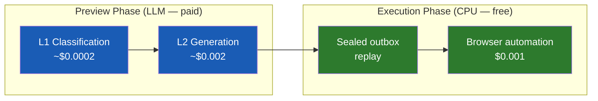

# Diagram 14: Preview → Approve → Execute — Full App Lifecycle
**Date:** 2026-03-01 | **Auth:** 65537
**Cross-ref:** Paper 06 (Evidence), Paper 07 (Budget), solace-cli/diagrams/10-core-flow.md

---

## Full Lifecycle

```mermaid
stateDiagram-v2
    [*] --> TRIGGER: User/schedule triggers app

    TRIGGER --> INTENT: App generates intent
    INTENT --> BUDGET_CHECK: Check budget gates (B1-B5)

    BUDGET_CHECK --> BLOCKED: Any gate fails
    BUDGET_CHECK --> PREVIEW: All gates pass

    PREVIEW --> PREVIEW_READY: LLM called ONCE\n(preview generated)

    PREVIEW_READY --> APPROVED: User clicks Approve
    PREVIEW_READY --> EDITED: User edits preview
    PREVIEW_READY --> REJECTED: User rejects
    PREVIEW_READY --> TIMEOUT: 30s timeout

    EDITED --> PREVIEW_READY: Updated preview shown
    REJECTED --> SEALED_ABORT: Evidence sealed (abort)
    TIMEOUT --> SEALED_ABORT: Evidence sealed (timeout=deny)

    APPROVED --> COOLDOWN: Risk-based pause
    note right of COOLDOWN: Low: 0s\nMedium: 5s\nHigh: 15s\nCritical: 30s+step-up

    COOLDOWN --> E_SIGN: E-sign (if logged in)
    E_SIGN --> SEALED: Output sealed to outbox\nchmod 444

    SEALED --> EXECUTING: CPU-only replay\n(NO LLM)

    EXECUTING --> DONE: All steps complete
    EXECUTING --> FAILED: Step error

    DONE --> EVIDENCE_SEAL: Hash chain sealed
    FAILED --> EVIDENCE_SEAL: Hash chain sealed
    BLOCKED --> EVIDENCE_SEAL: Hash chain sealed
    SEALED_ABORT --> EVIDENCE_SEAL: Hash chain sealed

    EVIDENCE_SEAL --> [*]: Budget decremented
```

## Cost Model



**Total per run: ~$0.003. Recipe replay: $0.001 (no LLM).**

## E-Signing Detail

```
E-SIGNATURE:
  user_id + timestamp + meaning + SHA256(record)

Meanings:
  "reviewed"     — I saw this preview
  "approved"     — I approve this action
  "authored"     — I created this content
  "responsible"  — I take responsibility

Signature = SHA256(user_id + timestamp + meaning + record_hash)
Cannot be detached (Part 11 §11.70)

Guest: no e-signing, actions logged unsigned
Logged-in: every approval e-signed, Part 11 ready
```

## Invariants

1. LLM called ONCE during preview, NEVER during execution
2. Execution is CPU-only deterministic replay of sealed output
3. Timeout = DENY (not proceed)
4. Sealed output is chmod 444 (immutable)
5. Evidence sealed for ALL outcomes (approve, reject, timeout, error)
6. E-signature links to record (cannot be detached)
