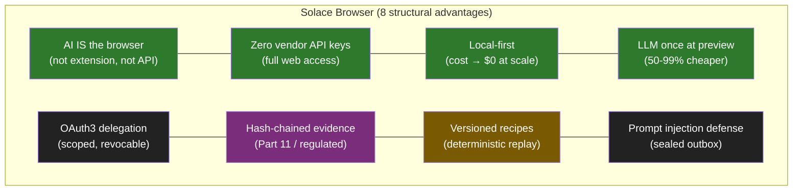
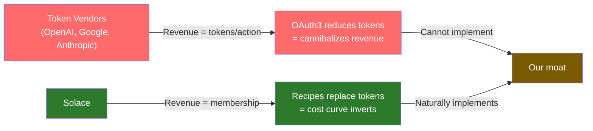

# Diagram 15: Competitive Position — Feature Matrix
**Date:** 2026-03-01 | **Auth:** 65537
**Cross-ref:** Paper 01 (Competitive Landscape)

---

## Feature Matrix vs Key Competitors

## Competitor Comparison

| Capability | Us | Atlas | Chrome | Copilot | Airtop | Bardeen | OpenClaw |
|-----------|-----|-------|--------|---------|--------|---------|----------|
| Full browser (not ext) | ✓ | ✓ | ✓ | ✗ | ✗ | ✗ | ✓ |
| No API keys needed | ✓ | ✓ | ✓ | ✗ | ✗ | ✓ | ✓ |
| Local-first | ✓ | ✗ | ✗ | ✗ | ✗ | ✗ | ✓ |
| LLM once (preview) | ✓ | ✗ | ✗ | ✗ | ✗ | ✗ | ✗ |
| OAuth3 delegation | ✓ | ✗ | ✗ | ✗ | ✗ | ✗ | ✗ |
| Hash-chained evidence | ✓ | ✗ | ✗ | ✗ | ✗ | ✗ | ✗ |
| Recipe marketplace | ✓ | ✗ | ✗ | ✗ | ✗ | partial | partial |
| Prompt injection defense | ✓ | ✗ | ✗ | ✗ | ✗ | ✗ | ✗ (RCE vuln) |
| Self-host | ✓ | ✗ | ✗ | ✗ | ✗ | ✗ | ✓ |
| BYOK (bring own key) | ✓ | ✗ | ✗ | ✗ | ✗ | ✗ | ✓ |
| Part 11 compliance | ✓ | ✗ | ✗ | ✗ | SOC2 only | ✗ | ✗ |
| Price | $8/mo | $20-200 | AI sub | $30/user | $26-342 | $99/mo | AWS |

## Why Token Vendors Cannot Copy

## No-API Exclusive Category

Services with no public API where we're the ONLY automation path:
- WhatsApp (web.whatsapp.com)
- Amazon (amazon.com)
- Twitter/X ($100+/mo API paywall)
- Instagram (business API only)
- LinkedIn (severely restricted 2023)

## Invariants

1. Eight advantages are mutually reinforcing (each strengthens others)
2. Token vendors cannot copy (kills their revenue model)
3. Extension vendors cannot copy (limited browser access)
4. Cloud vendors cannot copy (local-first economics)
5. $8/mo is cheapest product with most features (local-first = near-zero marginal cost)
