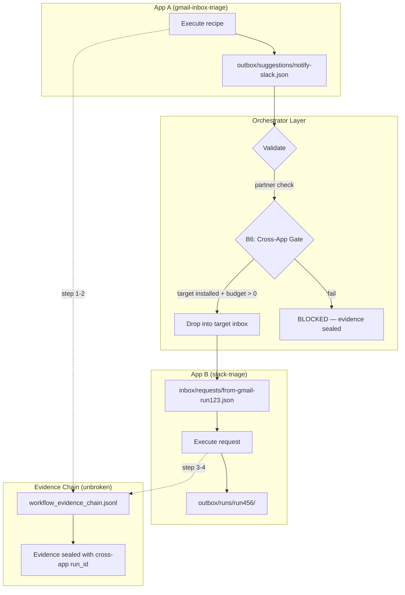
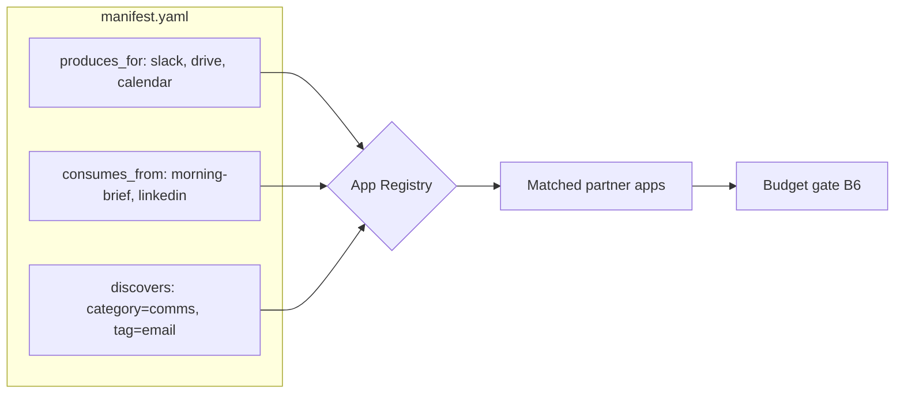
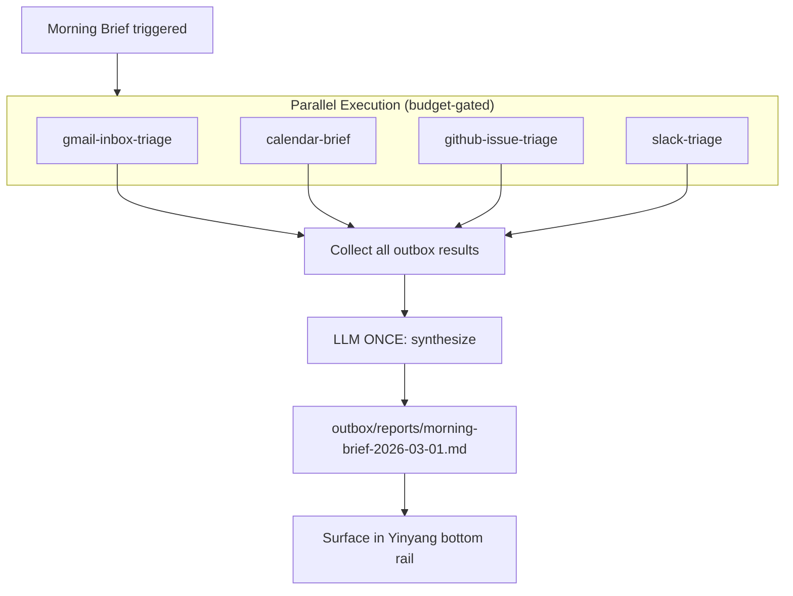
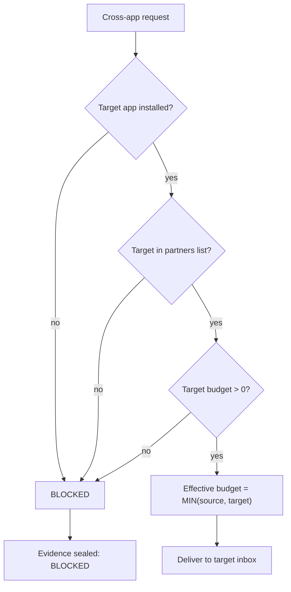
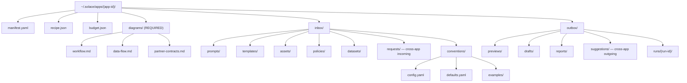

# Diagram 16: Cross-App Orchestration
**Paper:** 08-cross-app-yinyang-delight | **Auth:** 65537

## Cross-App Message Flow

## Partner Discovery

## Orchestrator App Pattern

## Budget Gate B6 (Cross-App)

## Required App Directory Structure

