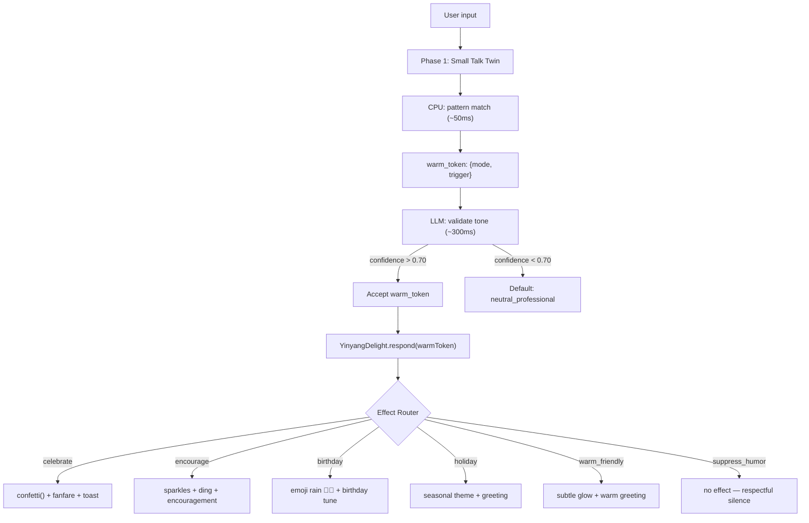
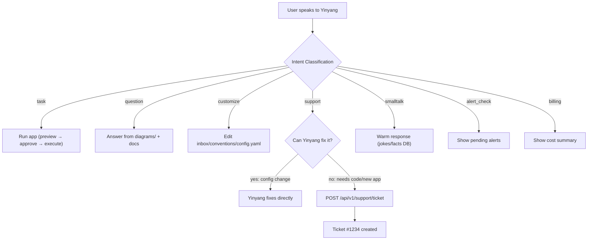
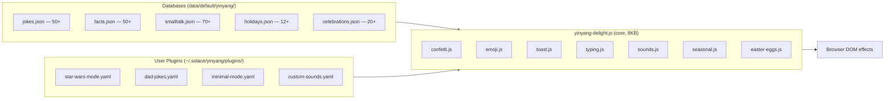
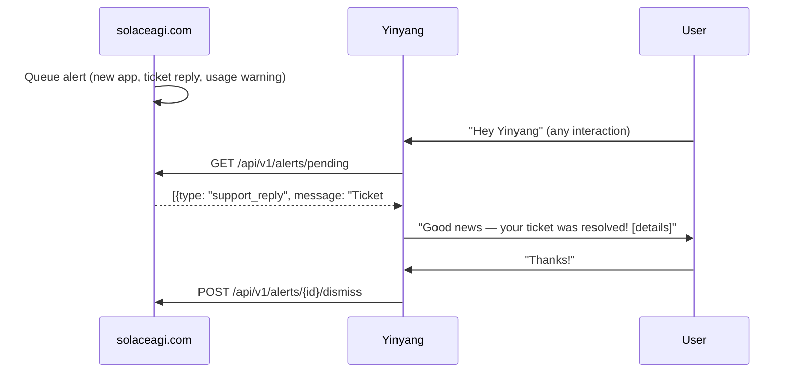
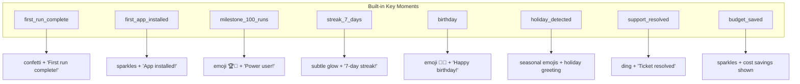

# Diagram 17: Yinyang Delight Pipeline
**Paper:** 08-cross-app-yinyang-delight | **Auth:** 65537

## Warm Token → Delight Effect

## Yinyang Universal Interface

## Delight Plugin Architecture

## Alert Queue Flow

## Key Moment Trigger Map

