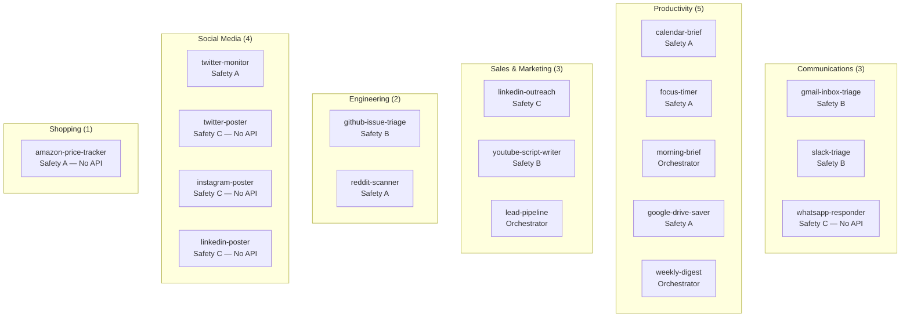
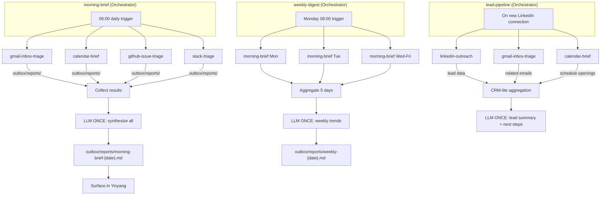
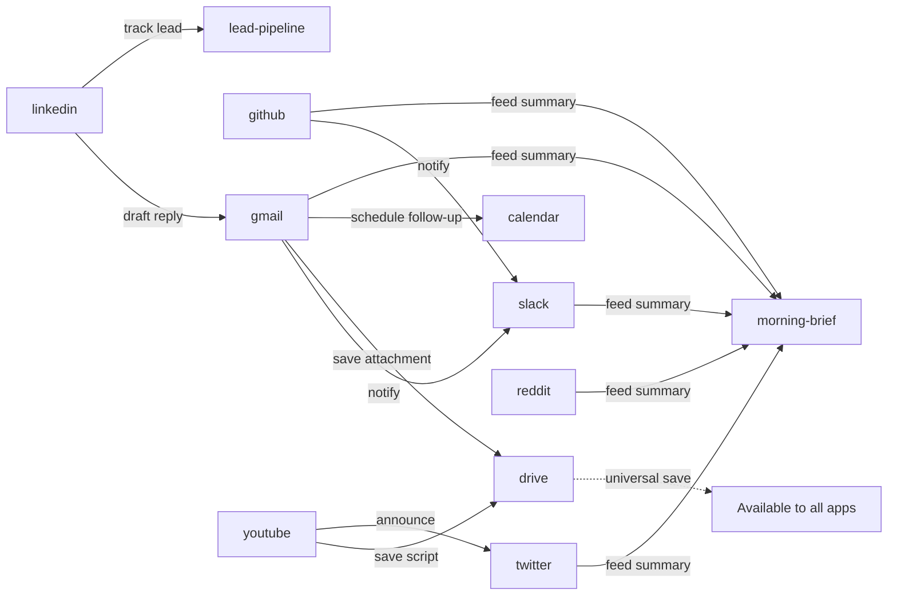
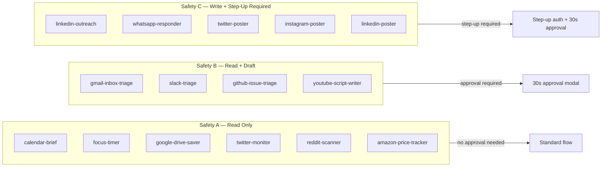

# Diagram 18: App Ecosystem — Day One
**Paper:** 08-cross-app-yinyang-delight | **Auth:** 65537

## 18 Apps: Standard + No-API Exclusive + Orchestrators

## Orchestrator Wiring

## Cross-App Partner Map

## Safety Tier Summary

