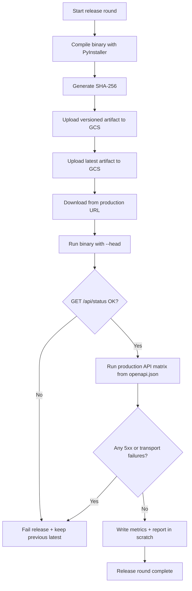

# 19 — Browser Release Loop

## Notes
- Versioned path is immutable (`v{VERSION}`), latest is mutable.
- Smoke runtime is head-on by default (`--head`), not headless.
- Production API matrix validates routing, auth gates, and server stability.
- Every round writes evidence and timings to `scratch/release-cycle/<timestamp>/`.
