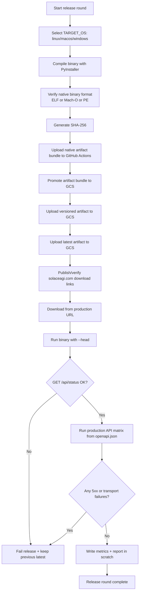

# 19 — Browser Release Loop

## Notes
- Platform object names:
  - Linux: `solace-browser-linux-x86_64`
  - macOS: `solace-browser-macos-universal`
  - Windows: `solace-browser-windows-x86_64.exe`
- Native host requirements:
  - Linux artifacts on Linux (`ubuntu-22.04` baseline in CI)
  - macOS artifacts on macOS (runner-native Mach-O)
  - Windows artifacts on Windows
- Binary-type gate is fail-closed:
  - reject upload if target artifact type does not match platform
- Versioned path is immutable (`v{VERSION}`), latest is mutable.
- Cache-control: `v{VERSION}` immutable caching; `latest` no-store.
- Website contract:
  - `www.solaceagi.com` must link to `https://storage.googleapis.com/solace-downloads/solace-browser/latest/<artifact>`
- Smoke runtime is head-on by default (`--head`), not headless.
- First run auto-installs missing Playwright Chromium into `~/.cache/ms-playwright`.
- Production API matrix validates routing, auth gates, and server stability.
- Every round writes evidence and timings to `scratch/release-cycle/<timestamp>/`.
