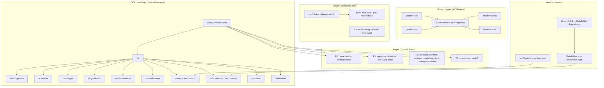
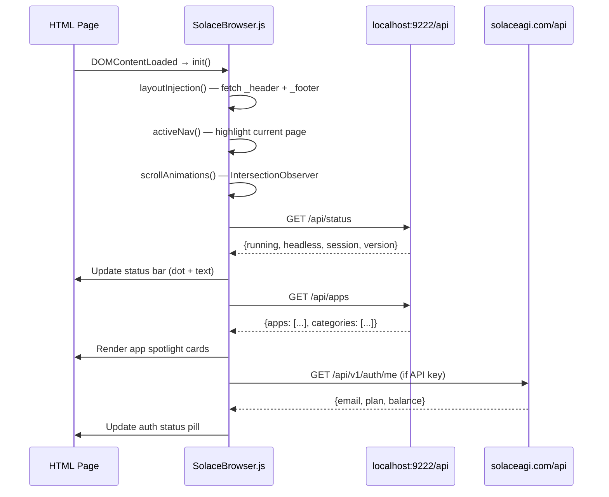
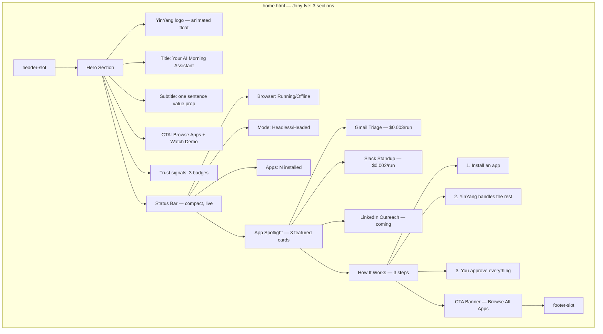
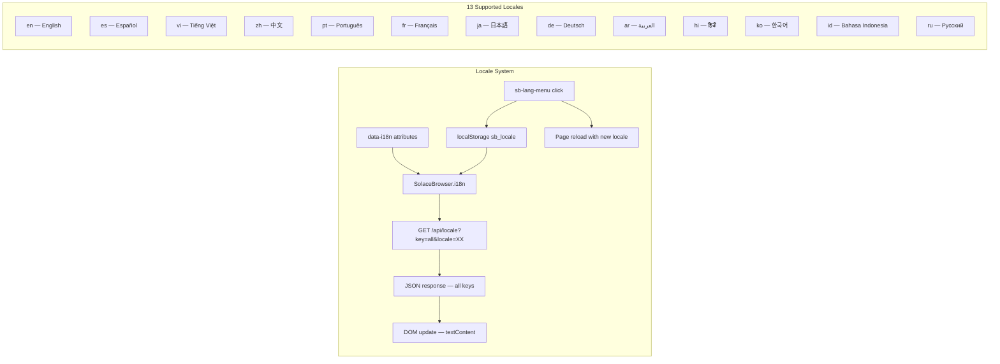
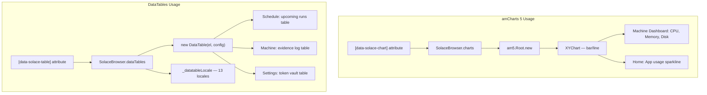

# Diagram 19: Browser UI Architecture — Ground-Up Rebuild
# Auth: 65537 | GLOW 128 | Pipeline: DIAGRAM → STYLEGUIDE → CODE
# DNA: `UI(browser) = layout_injection × OOP_class × design_tokens × 13_locales`
# Personas: Jony Ive (design lead), Linus Torvalds (code lead), Russell Brunson (funnel)

## 1. Component Hierarchy (Jony Ive: "Remove until it breaks, then add one thing back")

## 2. Data Flow: API → UI

## 3. Page Architecture: Home (P0)

## 4. i18n Architecture (13 locales)

## 5. Vendor Integration (amCharts + DataTables)

## Design Principles (Persona Committee)

| Persona | Principle | Applied Where |
|---------|-----------|---------------|
| **Jony Ive** | Remove until it breaks | Home: 12 sections → 3 |
| **Jony Ive** | Honest materials | CSS tokens, no inline styles |
| **Linus** | No memory leaks | IntersectionObserver.unobserve(), cleanup |
| **Linus** | No event listener leaks | AbortController for all listeners |
| **Russell Brunson** | Hook → Story → Offer | Hero → How It Works → CTA |
| **Rory Sutherland** | Perceived value ≠ functional | "$0.003/run" next to app names |
| **Vanessa** | Warm, not bureaucratic | "YinYang handles the rest" not "Execute recipe" |
| **MrBeast** | Screenshot-worthy | Hero with floating YinYang, gradient text |
