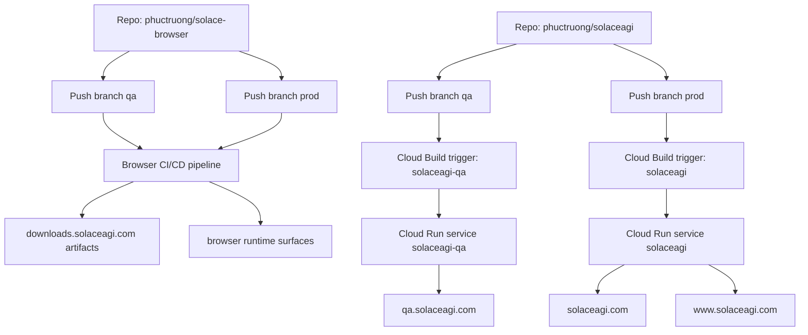

# 21 — Deployment Surface Mapping

## Notes
- `www.solaceagi.com` app-store is served by Cloud Run service `solaceagi`.
- `solaceagi` and `solaceagi-qa` deploy from repo `phuctruong/solaceagi`, not `phuctruong/solace-browser`.
- Deployment claims must validate domain mapping + trigger source before QA sign-off.

