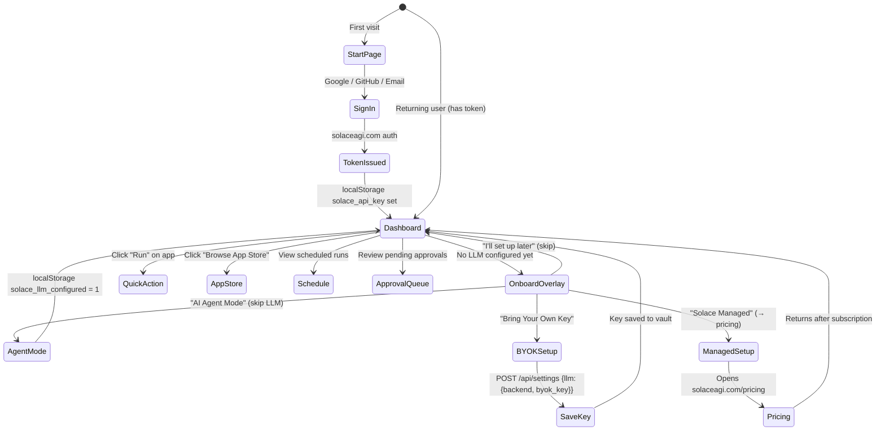

# Diagram 22: Home Dashboard & Onboarding Flow
# Auth: 65537 | GLOW 119
# DNA: `flow(new_user) = start(sign_in) → home(onboard_if_needed) → dashboard(value)`
# DNA: `flow(returning) = home(greeting) → quick_actions → activity`

## Context

The home page is a **dashboard**, not a marketing page. The customer already installed the browser — they're sold. The home page's job is to deliver instant value.

**Russell Brunson**: "They're in the door. Get them to the RESULT."
**Jony Ive**: "The best interface is no interface."

## Three User Paths

| Path | Entry | LLM Config | Monthly Cost |
|------|-------|------------|-------------|
| AI Agent Mode | Claude Code / Cursor / Codex via MCP | Not needed | Free |
| BYOK | Paste OpenRouter / Claude / OpenAI key | Own key in vault | Free |
| Solace Managed | solaceagi.com subscription | Together.ai Llama 3.3 70B | From $8/mo |

## User Flow



## Dashboard Components (home.html)

```mermaid
graph TD
    A[Header — shared nav + auth status] --> B
    B[Greeting — YinYang + "Good morning, phuc!"] --> C
    C[Status Bar — browser running/offline + mode + app count] --> D
    D[Quick Actions — Gmail Triage / Slack Standup / Browse Store] --> E
    E[Dashboard Grid 3-col]
    E --> F[Recent Activity]
    E --> G[Schedule]
    E --> H[Approval Queue]
    H --> I[Footer — 6-column grid]
```

## Onboarding Trigger Logic

```
shouldShow() {
  if (?onboard=1 in URL) → show (force)
  if (solace_llm_configured === '1') → hide
  if (sb_tutorial_v1 === 'done') → hide
  if (page !== '/' and page !== '/home') → hide
  else → show
}
```

## Key Files

| File | Role |
|------|------|
| `web/home.html` | Dashboard page (greeting + actions + cards) |
| `web/start.html` | Sign-in page (Google/GitHub/Email auth) |
| `web/js/onboarding.js` | LLM setup overlay (3 paths: agent/BYOK/managed) |
| `web/js/layout.js` | Shared header/footer injection |
| `web/css/site.css` | Dashboard styles (.dash-*) |

## Pricing Tiers (from Stripe / solaceagi.com)

| Tier | Price | Key Features |
|------|-------|-------------|
| Free | $0 | BYOK only, 5 tasks/day, local evidence |
| Starter | $8/mo | Managed LLM, overages $0.001/task |
| Pro | $28/mo | Cloud twin + OAuth3 vault + 90-day evidence |
| Team | $88/mo | 5 seats, 1-year evidence, team tokens |
| Enterprise | $188/mo | Unlimited, SOC2, SSO, dedicated nodes |

## Design Principles Applied

| Principle | Applied |
|-----------|---------|
| Russell Brunson | Customer is sold → deliver value, not sell |
| Jony Ive | Dashboard = function, not decoration |
| Linus Torvalds | AbortController cleanup, no memory leaks |
| Vanessa Van Edwards | Warm greeting by name + time of day |
| Rory Sutherland | Price anchoring on onboarding paths (Free/Free/$8) |
