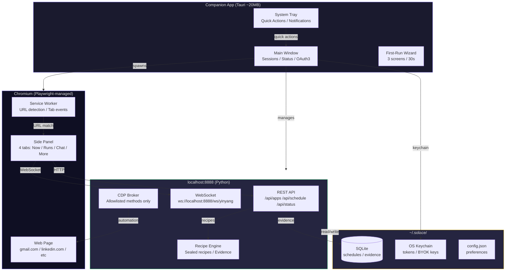
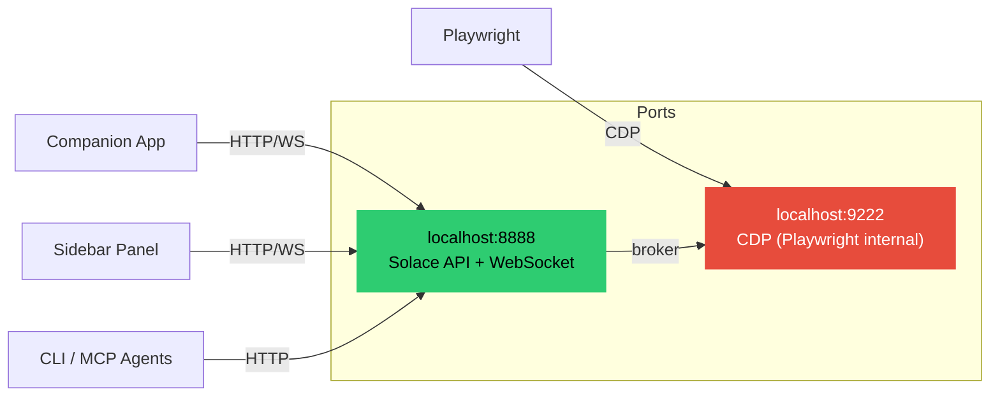
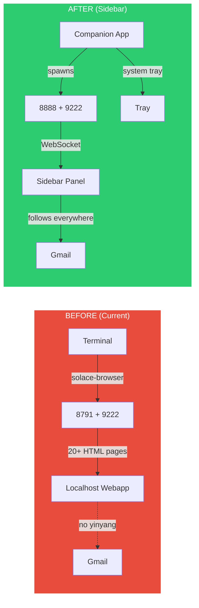

# Diagram 23: Three-Surface Architecture
# DNA: `companion(desktop) + sidebar(browser) + api(brain) = three_surfaces_one_server`
**Paper:** 47 (yinyang-sidebar-architecture) | **Auth:** 65537

---

## System Overview

## Port Map

## Before vs After

