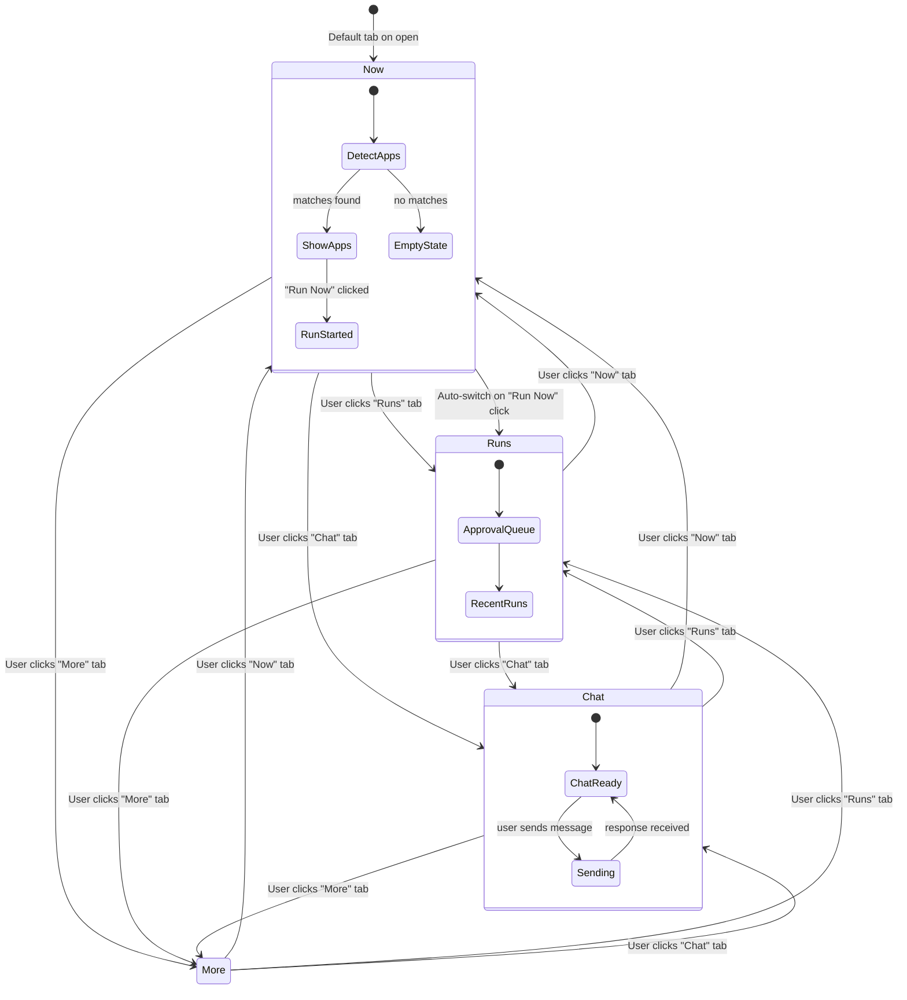
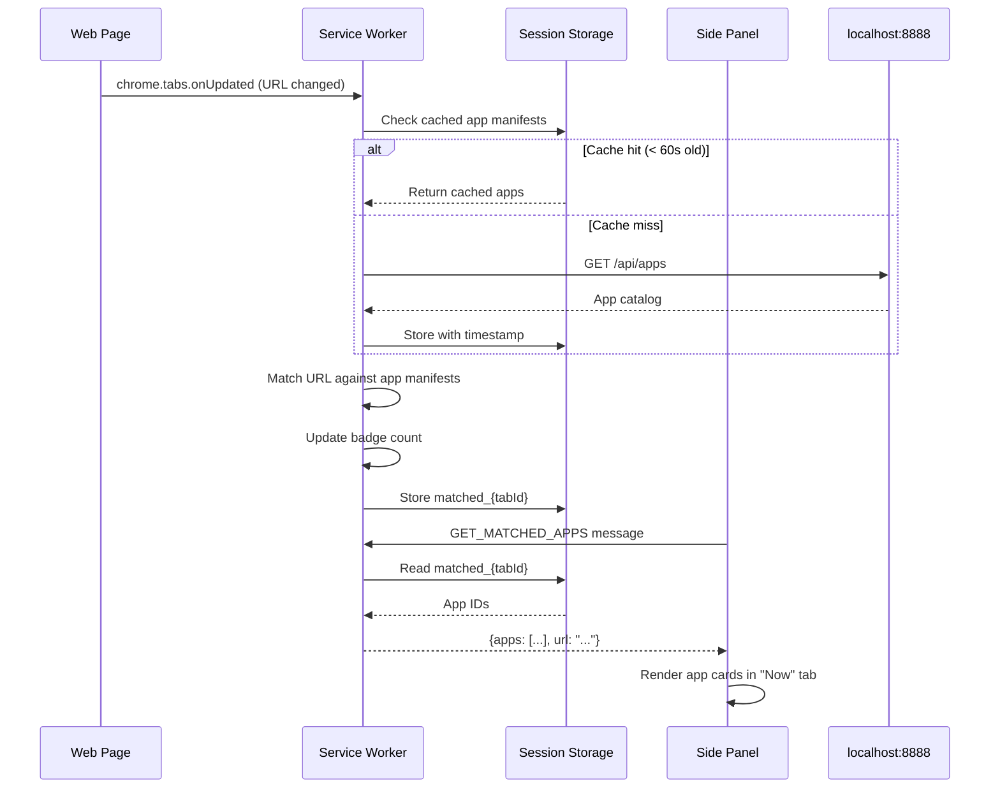
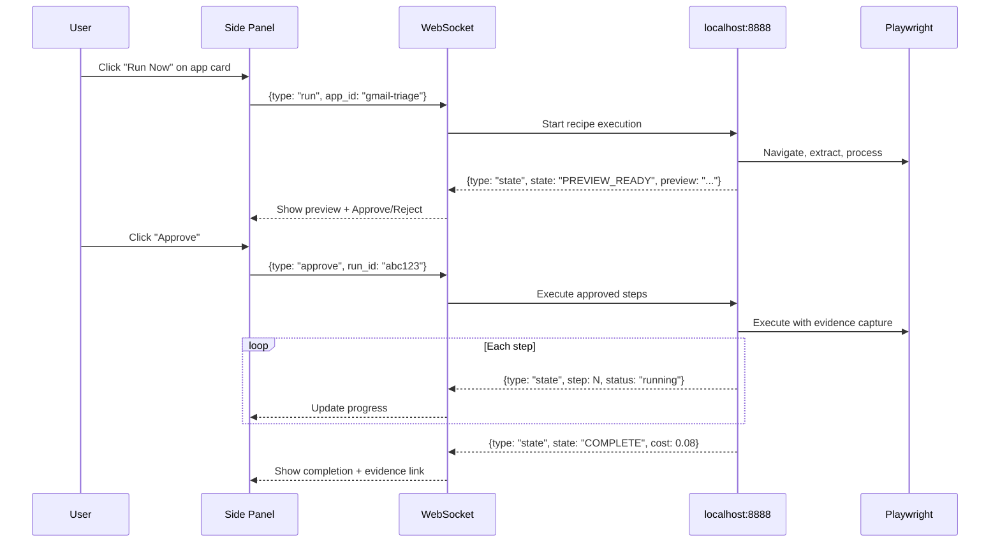

# Diagram 24: Sidebar Tab Flow
# DNA: `now(detect) + runs(history) + chat(converse) + more(settings) = 4_tabs_not_20_pages`
**Paper:** 47 (yinyang-sidebar-architecture) | **Auth:** 65537

---

## Tab State Machine

## App Detection Flow

## Run App Flow

