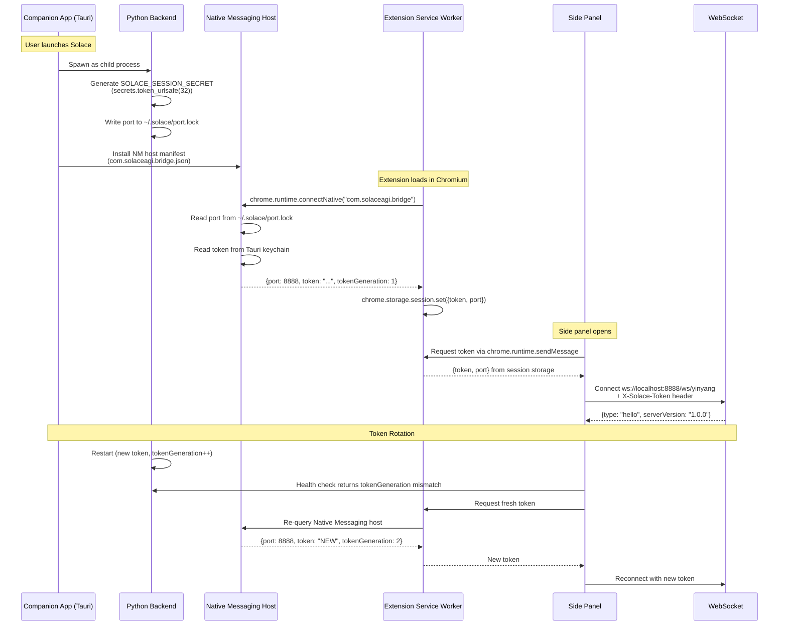
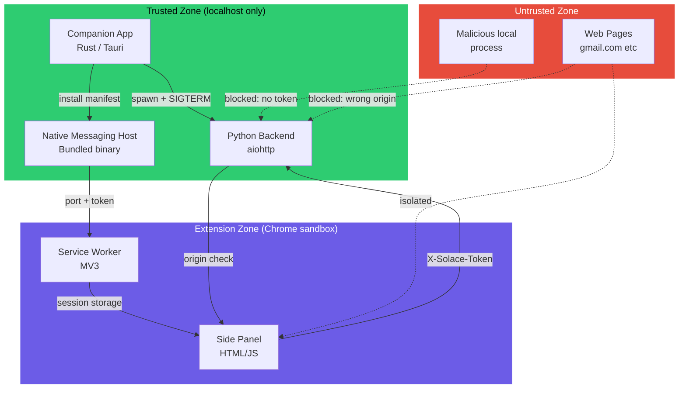
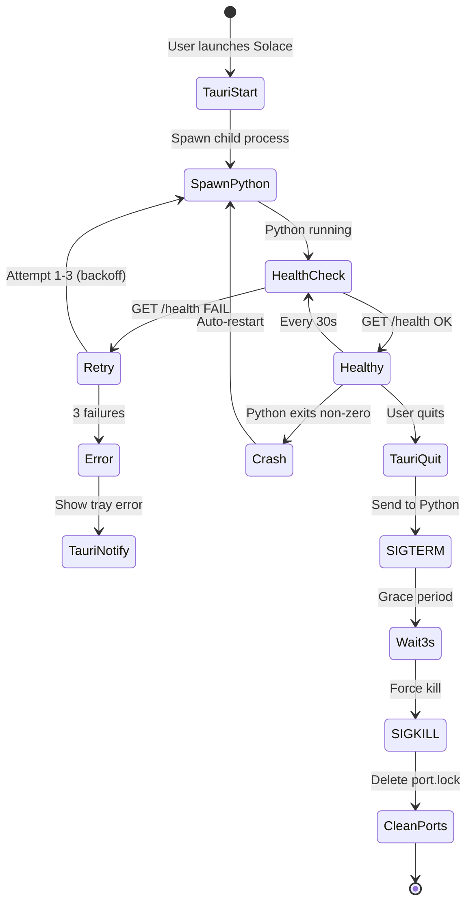

# Diagram 25: IPC / Native Messaging Flow
# DNA: `tauri(spawn) -> nm_host(bootstrap) -> extension(token) -> ws(connected) = secure_ipc`
**Paper:** 47, 48 (sidebar + companion) | **Auth:** 65537

---

## Token Bootstrap via Native Messaging

## Security Boundaries

## Process Lifecycle

