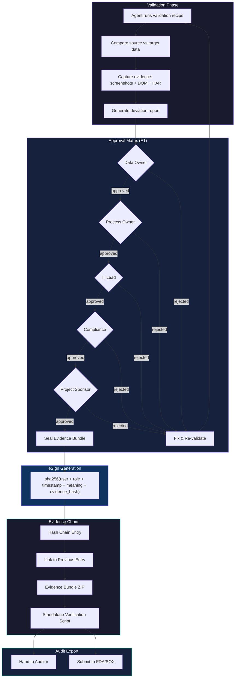

# Diagram 26: Business Acceptance eSign-Off Flow
# DNA: `validate(data) → approve(matrix) → esign(part11) → seal(evidence) → export(audit)`
# Paper: 47 (Section 21c) | Auth: 65537

## Interaction Notes
- Each approval node shows in sidebar "Runs" tab with role-specific buttons
- Rejected items loop back to validation with deviation record
- eSign is Part 11 §11.50 compliant: non-transferable, timestamped, meaning-attached
- Evidence bundle is self-verifying (includes Python verification script)
