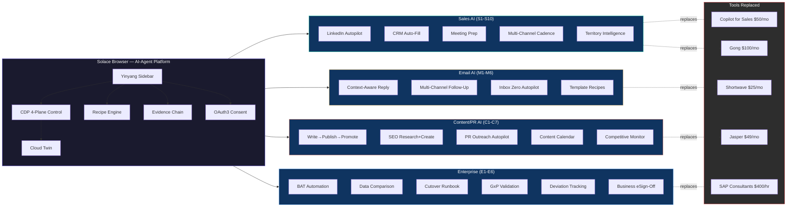

# Diagram 27: AI-Agent Browser — Vertical Market Architecture
# DNA: `browser(one) → verticals(sales, email, content, enterprise) → replaces(5+ tools)`
# Paper: 47 (Sections 20-21) | Auth: 65537

## Key Insight
One browser, four verticals, replacing $200-500/mo of point solutions with $28/mo (Pro).
The moat: every vertical shares the same evidence chain, recipe engine, and OAuth3 consent.
Point solutions can't replicate this because they only see one channel.
