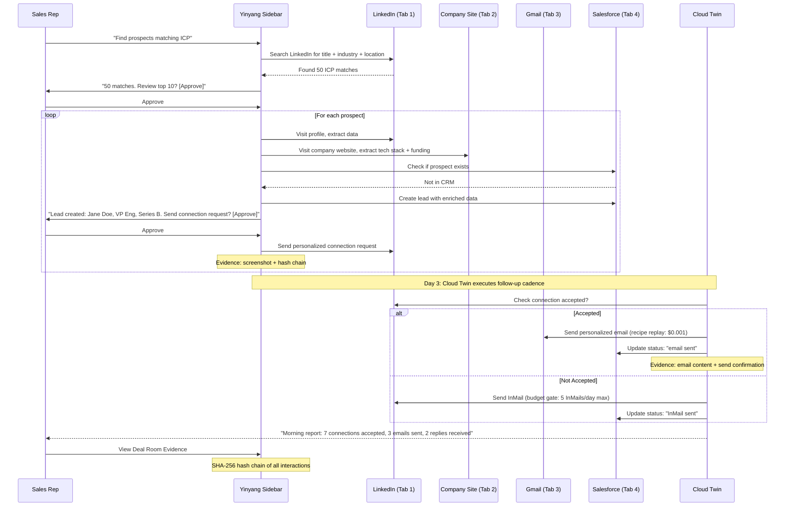

# Diagram 28: Sales Agent Multi-Channel Workflow
# DNA: `prospect(linkedin) → research(web) → outreach(email) → follow(cadence) → close(crm)`
# Paper: 47 (Section 21b) | Auth: 65537

## Why This Beats Copilot for Sales
- Copilot can draft an email. Solace executes a 5-step cross-channel workflow.
- Copilot sees CRM + Outlook. Solace sees LinkedIn + email + CRM + company website + everything.
- Cloud Twin runs the follow-up cadence overnight. Rep wakes up to a report.
