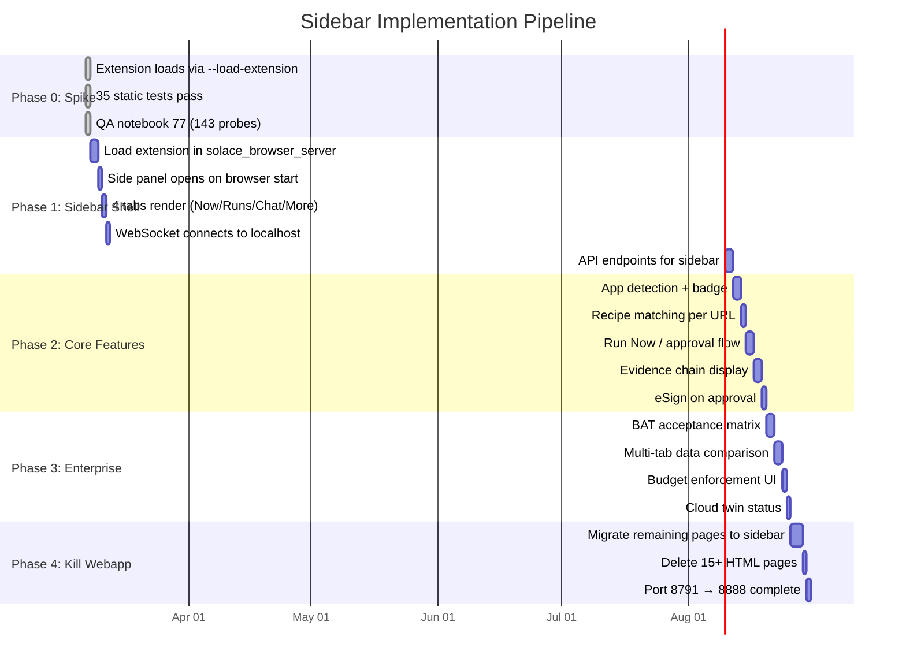

# Diagram 29: Sidebar Implementation Phases
# DNA: `implement(phase0→phase4) × test(probe) × ship(push)`
# Paper: 47 v8 | Auth: 65537

## Implementation Priority
1. Get extension loading in solace_browser_server.py (the prerequisite for everything)
2. WebSocket connection (the communication backbone)
3. App detection + Run Now (the core value)
4. Evidence + eSign (the compliance moat)
5. Enterprise features (the revenue driver)
