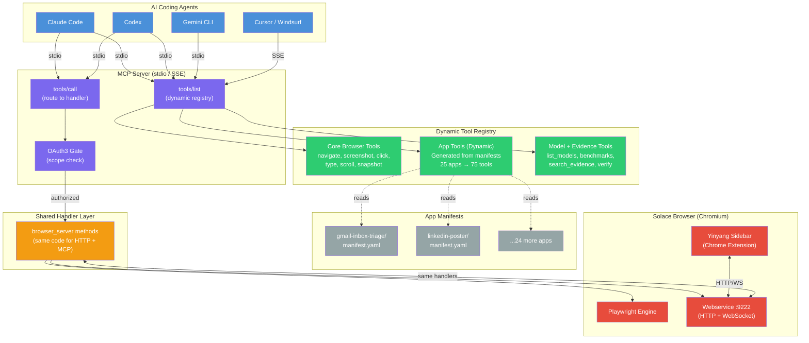
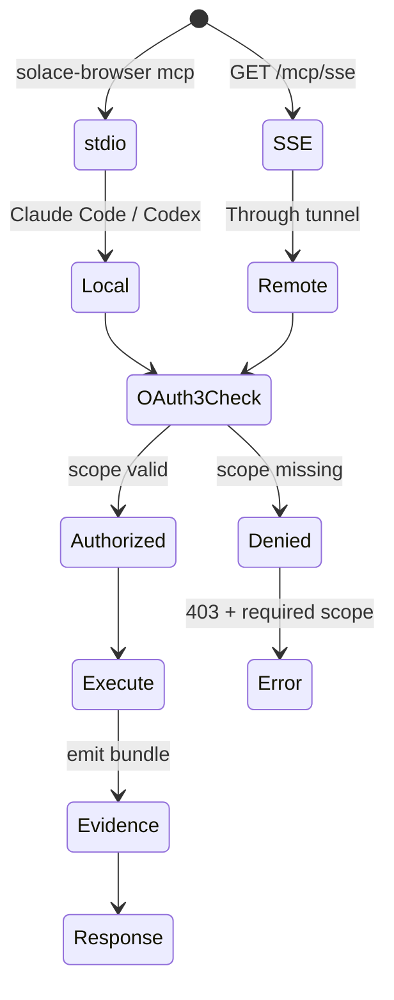
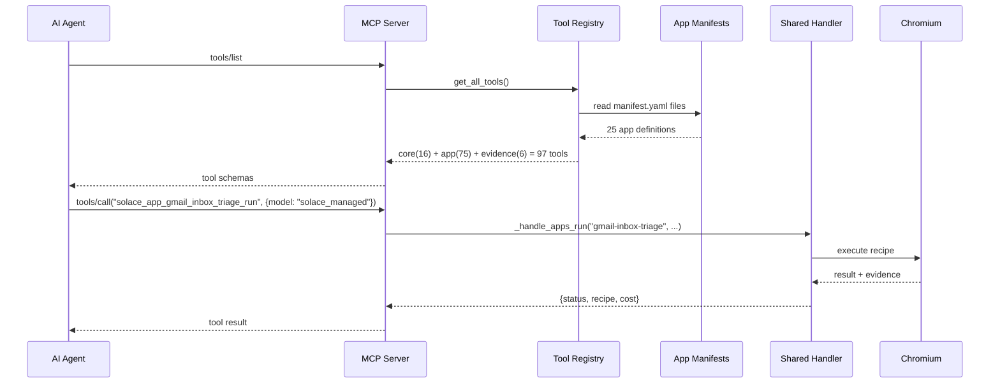

# Diagram 30: MCP Server Architecture — Dynamic App-to-Tool Mapping
# DNA: `mcp(discover, generate, route, gate) > hardcoded(drift, stale, fragile)`
# Forbidden: `HARDCODED_TOOLS | ORPHAN_API | ORPHAN_TOOL | UNGATED_MCP | TRADE_SECRET_LEAK`
# Paper: 47 §24 | Auth: 65537

## Key Architecture Properties

| Property | Implementation |
|----------|---------------|
| **Zero drift** | Tools generated from manifests at runtime |
| **Single handler** | MCP + HTTP both call same browser_server methods |
| **OAuth3 everywhere** | MCP calls scoped same as HTTP calls |
| **Trade secret safe** | Response filtering in shared handler layer |
| **Evidence chain** | Every MCP call produces evidence bundle |
| **Hot reload** | Manifest change → tool list updates (mtime cache) |

## Transport Modes

## Dynamic Tool Generation Flow

