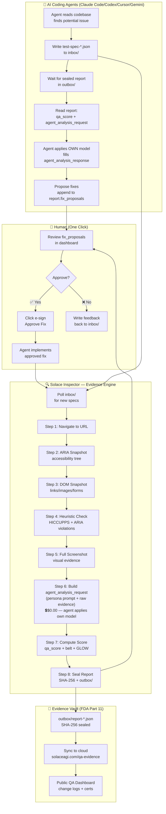
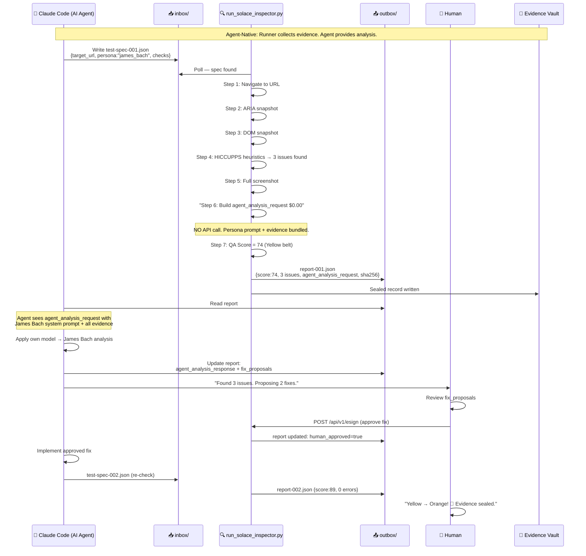
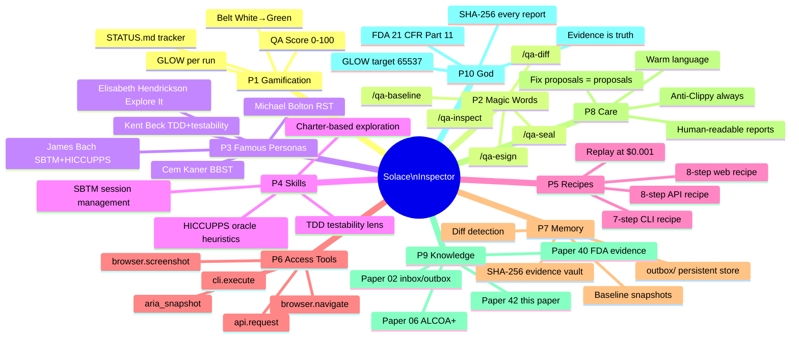
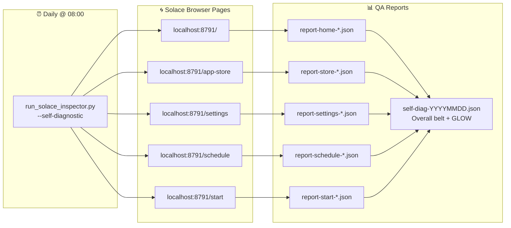
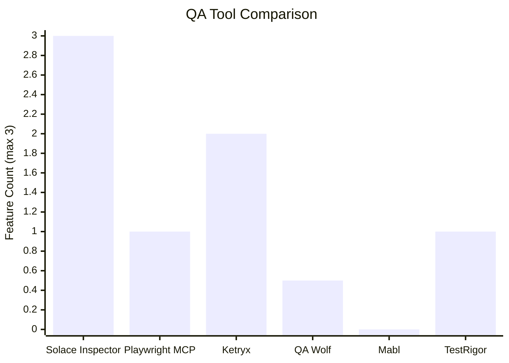

# Diagram 42: Solace Inspector — Agent-Native HITL QA System
# Committee: James Bach · Elisabeth Hendrickson · Kent Beck · Cem Kaner · Michael Bolton
# Auth: 65537 | GLOW: L | Date: 2026-03-03
# Architecture: Agent-native (zero LLM API calls — $0.00/run)

## Overview — The Full HITL Loop

## The Agent-Native Architecture

## 10 Uplift Injection Points (Paper 17)

## Self-Diagnostic Flow (Daily Health Check)

## Competitive Position (Confirmed March 2026)

> Agent Protocol (1pt) + Evidence Chain (1pt) + Human E-Sign (1pt) = 3/3 only Solace Inspector
