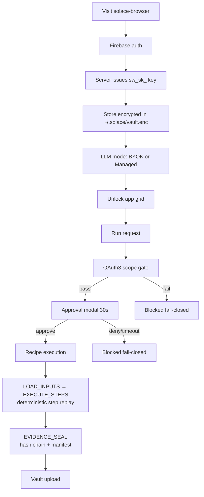
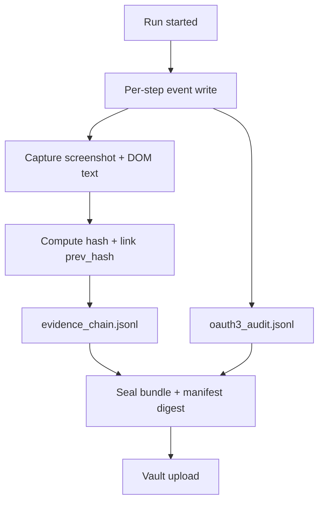
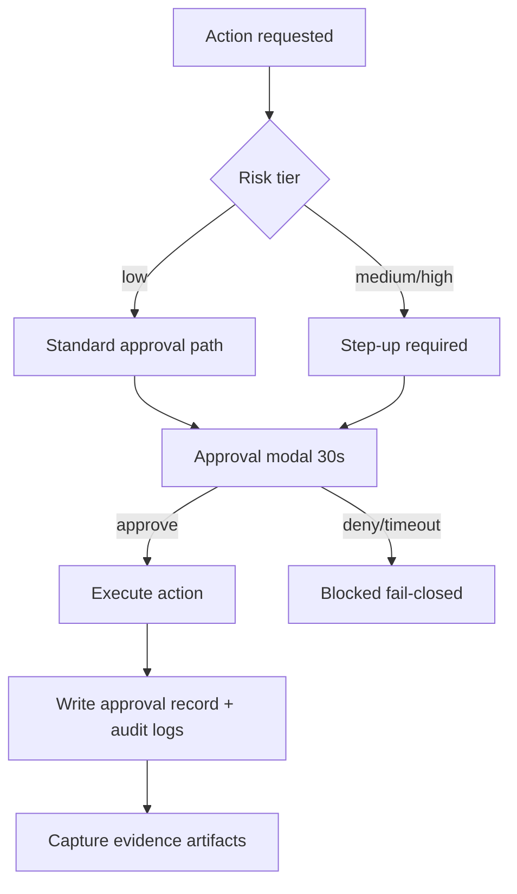

# solace-browser Diagram Index

**Sources:** 8 files (7 active + 1 deprecated), ~4.5 KB
**Purpose:** Mermaid diagrams for solace-browser runtime: auth, recipe execution, evidence, approval, session management, and customization. Aligned to deterministic, fail-closed, consent-native execution.

---

## File Index

| File | Purpose |
|------|---------|
| `01-auth-flow.md` | Firebase login → sw_sk_ key issuance → vault storage → LLM mode selection → app grid unlock → OAuth3 scope gate per action |
| `01-authentication-flow.md` | **DEPRECATED** — replaced by `01-auth-flow.md` |
| `02-component-hierarchy.md` | Browser app shell components: auth manager, recipe runner, approval modal, history viewer; API layers (/browser/*, /fs/*, /evidence/*) |
| `03-recipe-execution.md` | Recipe execution state machine (APPROVAL → PRECHECK → LOAD_INPUTS → EXECUTE_STEPS → EVIDENCE_SEAL → COST → COMPLETE); deterministic step replay |
| `04-evidence-collection.md` | Per-step event write → screenshot/DOM capture → hash chain (evidence_chain.jsonl + oauth3_audit.jsonl) → seal bundle → vault upload |
| `05-customization-flow.md` | Inbox file load → validate overrides → merge with app defaults → execute recipe → write outbox + evidence |
| `06-session-management.md` | Browser session lifecycle: OAuth3 token bind → revocation check → scoped actions → keepalive → release |
| `07-approval-stepup-flow.md` | Risk tier → standard approval or step-up → 30s approval modal → execute or fail-closed → write approval record + evidence |

---

## Color Legend

solace-browser diagrams use Mermaid defaults (no custom classDef) — no explicit color coding conventions beyond Mermaid's default node styling.

---

## Runtime Control API

The active browser webservice is `solace_browser_server.py`. Snapshot and control consumers should use `/api/status`, `/api/navigate`, `/api/snapshot`, `/api/evaluate`, `/api/aria-snapshot`, `/api/dom-snapshot`, and `/api/page-snapshot`.

## Architecture Rules Reflected in Diagrams

- **No chat component in runtime path** — recipe runner is deterministic, not conversational (see 02, 03)
- **No triple-twin orchestration** — solace-browser does not run the triple-twin; that lives in stillwater/cli
- **No runtime self-learning mutation** — CPU learner does not run in browser; recipes are static graphs
- **Inbox-driven customization before execution** — overrides are validated and merged before any step runs (see 05)
- **OAuth3 gate before every sensitive operation** — scope check is a hard gate, not advisory (see 01, 06)
- **Approval is precondition, not afterthought** — approval modal fires before execution, timeout defaults to deny (see 07)
- **Evidence is parallel to execution, not post-hoc** — hash chain written per step, not at end (see 04)
- **Fail-closed everywhere** — OAuth3 denied, timeout, validation failure, revocation all route to blocked/stopped (see 01, 05, 06, 07)

---

## Key Mermaid: Auth + Recipe Execution Flow

---

## Key Mermaid: Evidence Hash Chain (04)

Note: Audit stream and evidence stream are separate JSONL files sharing the same `run_id`. The hash chain is validated on evidence retrieval.

---

## Key Mermaid: Approval + Step-Up (07)

High-risk scopes (send, delete, financial) always require step-up regardless of prior approval history.
